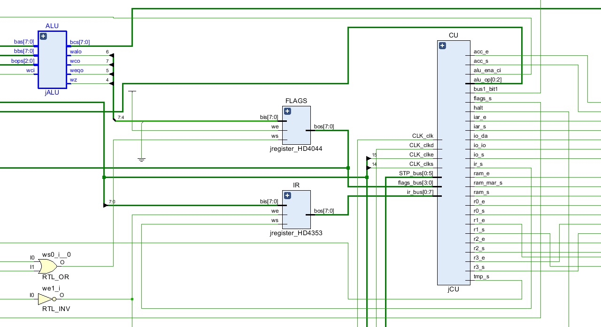

# JCSCPU-HW
Hardware implementation, using a Digilent Basys-3 FPGA board, of the computer described in J. Clark Scott's book "But How Do It Know?".

But How Do It Know?: http://www.buthowdoitknow.com/

# Addition Demo

# Multiplication Demo

# Fibonacci Demo

# Complete Youtube playlist
https://www.youtube.com/playlist?list=PLYE0XunAbwfBt2wXgDHEYPtILpimne_R9
